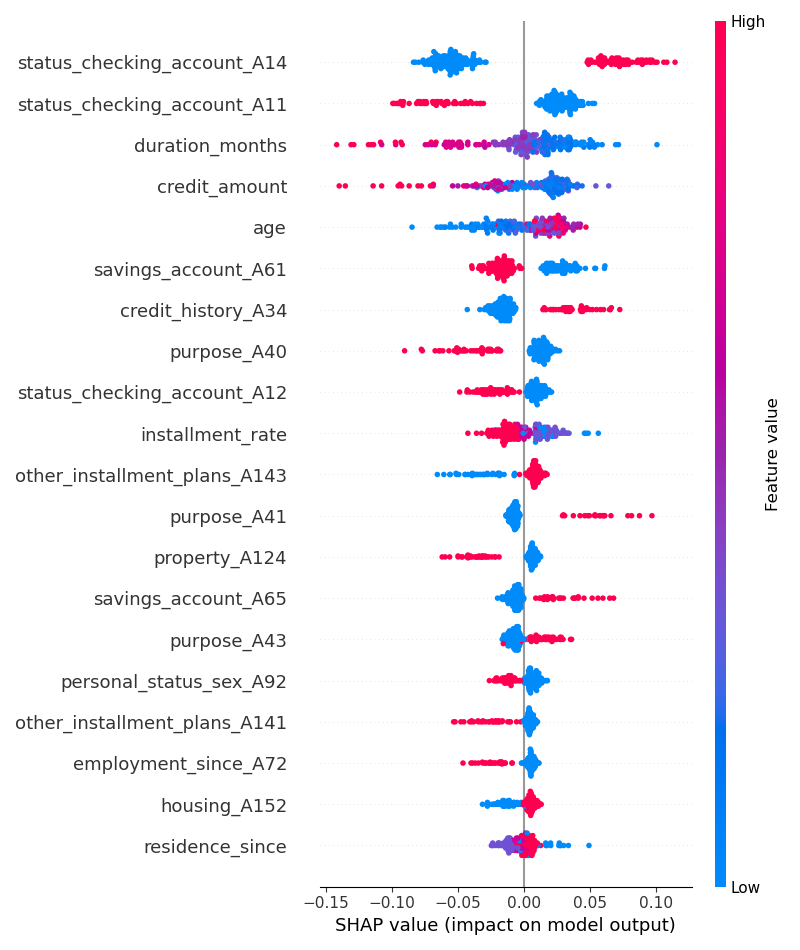
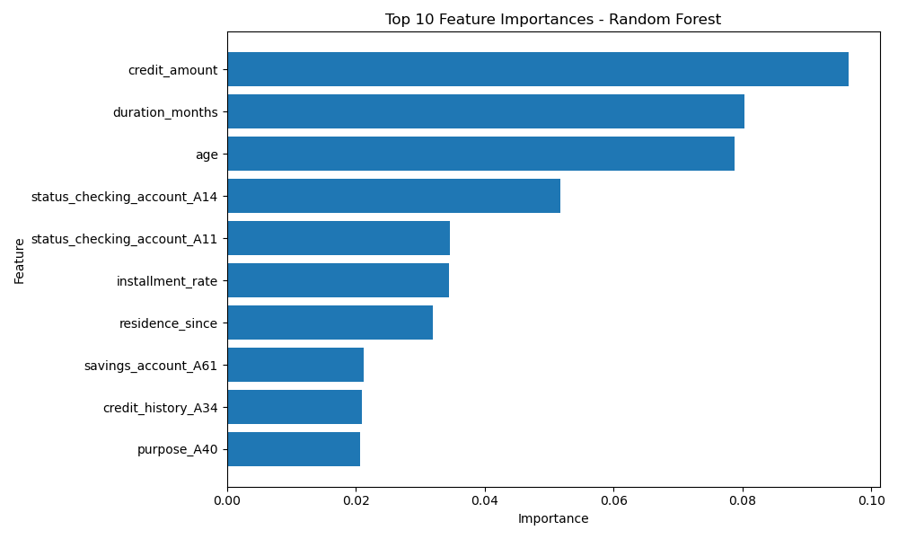

# Decision-Focused Loan Approval System  
### Model Multiplicity, Explainability, and Recourse in Credit Decision-Making

---

## Abstract

Machine learning systems used in financial decision-making are often assumed to be stable and consistent when performance metrics are similar. However, this assumption breaks under the phenomenon of **model multiplicity**, where different models with comparable predictive performance can produce conflicting decisions for the same individuals.

This project investigates model multiplicity in the context of **loan approval systems** using the German Credit dataset. We train multiple supervised learning models, evaluate their predictive performance, and analyze disagreement patterns across models. Furthermore, we apply **Explainable AI (XAI)** techniques and conduct a preliminary **recourse analysis** to explore how decisions can be interpreted and potentially altered.

---

## 1. Problem Statement

Credit scoring systems are widely used in banking and financial institutions to automate loan approval decisions. However, these systems face three critical challenges:

- Lack of interpretability in model decisions  
- Inconsistency between equally accurate models (model multiplicity)  
- Limited actionable recourse for rejected applicants  

This project addresses these issues by analyzing how different models behave under the same data distribution and whether their decisions remain consistent.

---

## 2. Objectives

- Develop baseline machine learning models for loan approval prediction  
- Compare predictive performance across multiple models  
- Quantify and analyze model disagreement (multiplicity effects)  
- Apply explainability techniques (SHAP) to interpret predictions  
- Explore simple recourse strategies for decision alteration  

---

## 3. Dataset

- **Dataset:** German Credit Dataset  
- **Source:** UCI Machine Learning Repository  
- **Task:** Binary classification (creditworthy vs non-creditworthy applicants)

📎 https://archive.ics.uci.edu/ml/datasets/statlog+(german+credit+data)

---

## 4. Methodology

### 4.1 Data Processing
- Handling categorical encoding
- Feature scaling where necessary
- Train-test split for evaluation consistency

### 4.2 Models Implemented
- Logistic Regression (interpretable baseline)
- Random Forest Classifier (non-linear ensemble model)

### 4.3 Evaluation Metrics
- Accuracy
- Model disagreement rate
- Feature importance comparison

---

## 5. Model Multiplicity Analysis

Despite similar predictive performance, models exhibited **non-trivial disagreement** on individual predictions.

### Key Observation:
- Logistic Regression Accuracy: **70.5%**
- Random Forest Accuracy: **75.0%**
- Disagreement Rate: **12.5%**

This indicates that performance metrics alone are insufficient to guarantee consistent decision-making in high-stakes domains.

---

## 6. Explainability Analysis (XAI)

To interpret model behavior, we applied:

- **SHAP (SHapley Additive exPlanations)**  
- Feature importance ranking from tree-based models  

### Key Drivers of Prediction:
- Credit amount  
- Loan duration  
- Checking account status  
- Age  

These features consistently influenced model decisions across approaches.

---

## 7. Visual Interpretability

### SHAP Summary Analysis  


### Feature Importance (Random Forest)  


---

## 8. Recourse Analysis

A preliminary recourse experiment was conducted by modifying individual applicant features and observing changes in predicted outcomes.

### Findings:
- Small feature perturbations can significantly alter predictions  
- Non-linear models show non-intuitive decision boundaries  
- Highlights the need for **causal recourse frameworks**, not just correlational adjustments  

---

## 9. Key Insights

- High-performing models are not necessarily consistent models  
- Model multiplicity is a real risk in automated financial decision systems  
- Explainability tools help but do not fully resolve decision instability  
- Recourse requires causal reasoning beyond predictive modeling  

---

## 10. Future Work

- Fairness-aware credit scoring systems  
- Counterfactual explanation frameworks  
- Causal inference for recourse modeling  
- Rashomon set exploration for model selection stability  
- Robustness testing under distribution shifts  

---

## 11. Technologies Used

- Python  
- NumPy & Pandas  
- Scikit-learn  
- Matplotlib  
- SHAP  
- Jupyter Notebook  

---

## 12. Project Structure

```text
Decision-Focused-Loan-Approval-System/
│
├── data/               # Raw and processed datasets
├── figures/            # Visual outputs (SHAP, feature importance)
├── notebooks/          # Jupyter notebooks (experiments & analysis)
├── results/            # Model outputs and evaluation logs
├── src/                # Source code modules
├── README.md           # Project documentation
└── requirements.txt    # Dependencies
```
---

## 14. Reproducibility

This project is fully reproducible. Follow the steps below to replicate the experiments and results.

### 14.1 Clone the repository
```bash
git clone https://github.com/Katso-John-Obotsang/decision-focused-loan-approval-system.git
cd decision-focused-loan-approval-system
```
---
### 14.2 Create a virtual environment (recommended)
```bash
conda create -n loan-approval python=3.10
conda activate loan-approval
```
---
### 14.3 Install dependencies
```bash
pip install -r requirements.txt
```
---
### 14.4 Run the project
Open Jupyter Notebook and execute the analysis:
```bash
jupyter notebook
```


Ensure that all datasets are located in the `data/` directory before running the notebooks.


## 15. Author

Katso John Obotsang<br>
Machine Learning | Quantitative Methods | AI Research<br>
Email: katsojohnobotsang@gmail.com

---

## 16. License

This project is licensed under the MIT License.

See the full license here: [LICENSE](LICENSE)
